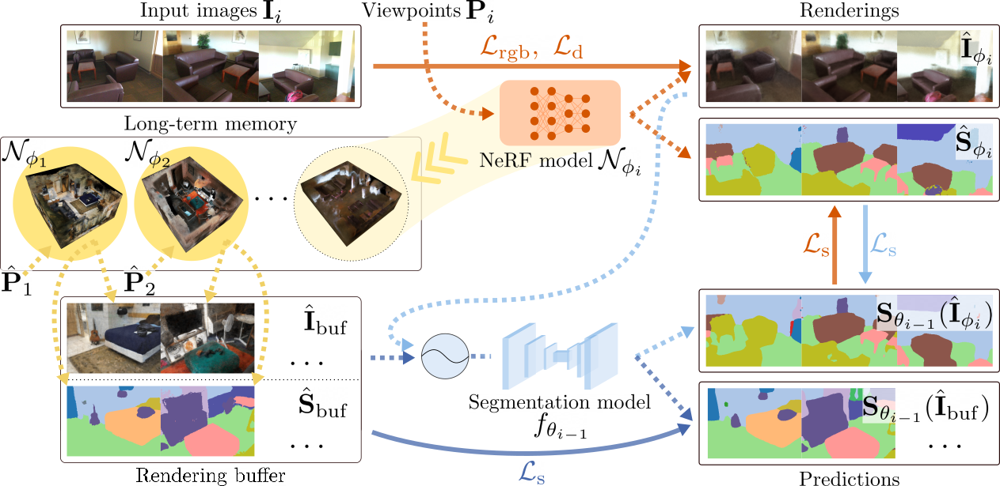

<h1 align="center">Unsupervised Continual Semantic Adaptation through Neural Rendering</h1>

<p align="center">
<strong><a href="https://scholar.google.com/citations?user=Asc7j9oAAAAJ&hl=en&oi=ao">Zhizheng Liu</a></strong>*, <strong><a href="https://scholar.google.com/citations?user=qwSANZoAAAAJ&hl=en&oi=ao">Francesco Milano</a></strong>*, <strong><a href="https://scholar.google.com/citations?user=e5uPDzcAAAAJ&hl=en&oi=ao">Jonas Frey</a></strong>, <strong><a href="https://asl.ethz.ch/">Roland Siegwart</a></strong>, <strong><a href="https://hermannblum.net/">Hermann Blum</a></strong>, <strong><a href="https://n.ethz.ch/~cesarc/">Cesar Cadena</a></strong>
</p>

<h2 align="center">CVPR 2023</h2>
<h3 align="center"><a href="https://arxiv.org/abs/2211.13969">Paper</a> | <a href="https://www.youtube.com/watch?v=XfNLsl8ATNY">Video</a> | <a href="https://ethz-asl.github.io/ucsa_neural_rendering/">Project Page</a></h3>

<p align="center">
  <a href="">
    
  </a>
</p>

We present a framework to improve semantic scene understanding for agents that are deployed across a _sequence of scenes_. In particular, our method performs unsupervised continual semantic adaptation by jointly training a _2-D segmentation model_ and a _Semantic-NeRF network_.

- Our framework allows successfully adapting the 2-D segmentation model across _multiple, previously unseen scenes_ and with _no ground-truth supervision_, reducing the domain gap in the new scenes and improving on the initial performance of the model.
- By rendering training and novel views, the pipeline can effectively _mitigate forgetting_ and even _gain additional knowledge_ about the previous scenes.

## Table of Contents

1. [Installation](#installation)
2. [Running experiments](#running-experiments)
3. [Citation](#citation)
4. [Acknowledgements](#acknowledgements)
5. [Contact](#contact)

## Installation

### Workspace setup

We recommend configuring your workspace with a conda environment. You can then install the project and its dependencies as follows. The instructions were tested on Ubuntu 20.04 and 22.04, with CUDA 11.3.

- Clone this repo to a folder of your choice, which in the following we will refer to with the environmental variable `REPO_ROOT`:
  ```bash
  export REPO_ROOT=<FOLDER_PATH_HERE>
  cd ${REPO_ROOT};
  git clone git@github.com:ethz-asl/nr_semantic_segmentation.git
  ```
- Create a conda environment and install [PyTorch](https://pytorch.org/), [tiny-cuda-nn](https://github.com/NVlabs/tiny-cuda-nn) and other dependencies:

  ```bash
  conda create -n nr4seg python=3.8
  conda activate nr4seg
  python -m pip install --upgrade pip

  # For CUDA 11.3.
  conda install pytorch==1.11.0 torchvision==0.12.0 torchaudio==0.11.0 cudatoolkit=11.3 -c pytorch
  # Install tiny-cuda-nn
  pip install git+https://github.com/NVlabs/tiny-cuda-nn/#subdirectory=bindings/torch

  pip install -r requirements.txt

  python setup.py develop
  ```

### Setting up the dataset

We use the [ScanNet v2](http://www.scan-net.org/) [1] dataset for our experiments.

> [1] Angela Dai, Angel X. Chang, Manolis Savva, Maciej Halber, Thomas Funkhouser, and Matthias Nießner, "ScanNet: Richly-annotated 3D Reconstructions of Indoor Scenes", in _Proceedings of the IEEE/CVF Conference on Computer Vision and Pattern Recognition (CVPR)_, pp. 2432-2443, 2017.

#### Dataset download

- To get started, visit the official [ScanNet](https://github.com/ScanNet/ScanNet#scannet-data) dataset website to obtain the data downloading permission and script. We keep all the ScanNet data in the `${REPO_ROOT}/data/scannet` folder. You may use a symbolic link if necessary (_e.g._, `ln -s <YOUR_DOWNLOAD_FOLDER> ${REPO_ROOT}/data/scannet`).
- As detailed in the paper, we use scenes `0000` to `0009` to perform continual semantic adaptation, and a subset of data from the remaining scenes (`0010` to `0706`) to pre-train the segmentation network.
  - The data from the pre-training scenes are conveniently provided already in the correct format by the ScanNet dataset, as a `scannet_frames_25k.zip` file. You can download this file using the official download script that you should have received after requesting access to the dataset, specifying the `--preprocessed_frames` flag. Once downloaded, the content of the file should be extracted to the subfolder `${REPO_ROOT}/data/scannet/scannet_frames_25k`.
  - For the scenes used to perform continual semantic adaptation, the full data are required. To obtain them, run the official download script, specifying through the flag `--id` the scene to download (_e.g._, `--id scene0000_00` to download scene `0000`) and including the `--label_map` flag, to download also the label mapping file `scannetv2-labels.combined.tsv` (cf. [here](https://github.com/ScanNet/ScanNet#labels)). The downloaded data should be stored in the subfolder `${REPO_ROOT}/data/scannet/scans`. Next, extract all the sensor data (depth images, color images, poses, intrinsics) using the [SensReader](https://github.com/ScanNet/ScanNet/tree/master/SensReader/python) tool provided by ScanNet, for each of the downloaded scenes from `0000` to `0009`. For instance, for scene `0000`, run
    ```bash
    python2 reader.py --filename ${REPO_ROOT}/data/scannet/scans/scene0000_00/scene0000_00.sens --output_path ${REPO_ROOT}/data/scannet/scans/scene0000_00 --export_depth_images --export_color_images --export_poses --export_intrinsics
    ```
    To obtain the raw labels (for evaluation purposes) for each of the continual adaptation scenes, also extract the content of the `sceneXXXX_XX_2d-label-filt.zip` file, so that a `${REPO_ROOT}/data/scannet/scans/sceneXXXX_XX/label-filt` folder is created.
  - Copy the `scannetv2-labels.combined.tsv` file to each scene folder under `${REPO_ROOT}/data/scannet/scans`, as well as to the subfolder `${REPO_ROOT}/data/scannet/scannet_frames_25k`.

  - At the end of the process, the `${REPO_ROOT}/data` folder should contain _at least_ the following data, structured as below:

    ```shell
    scannet
      scannet_frames_25k
        scene0010_00
          color
            000000.jpg
            ...
            XXXXXX.jpg
          label
            000000.png
            ...
            XXXXXX.png
        ...
        ...
        scene0706_00
          ...
        scannetv2-labels.combined.tsv
      scans
        scene0000_00
          color
            000000.jpg
            ...
            XXXXXX.jpg
          depth
            000000.png
            ...
            XXXXXX.png
          label-filt
            000000.png
            ...
            XXXXXX.png
          pose
            000000.txt
            ...
            XXXXXX.txt
          intrinsics
            intriniscs_color.txt
            intrinsics_depth.txt
          scannetv2-labels.combined.tsv
        ...
        scene0009_00
          ...
    ```

    You may define the data subfolders differently by adjusting the `scannet` and `scannet_frames_25k` fields in [`cfg/env/env.yml`](./cfg/env/env.yml). You may also define several config files and set the configuration to use by specifying the `ENV_WORKSTATION_NAME` environmental variable before running the code (_e.g._, `export ENV_WORKSTATION_NAME="gpu_machine"` to use the config in `cfg/env/gpu_machine.yml`).

- Copy the files [`split.npz`](./cfg/dataset/scannet/split.npz) and [`split_cl.npz`](./cfg/dataset/scannet/split_cl.npz) from the `${REPO_ROOT}/cfg/dataset/scannet/` folder to the `${REPO_ROOT}/data/scannet/scannet_frames_25k` folder. These files contain the indices of the samples that define the train/validation splits used in pre-training and to form the replay buffer in continual adaptation, to ensure reproducibility.

#### Dataset pre-processing

After organizing the ScanNet files as detailed above, run the following script to pre-process the files:

```bash
bash run_scripts/preprocess_scannet.sh
```

After pre-processing, the folder structure for each `sceneXXXX_XX` from `scene0000_00` to `scene0009_00` should look as follows:

```shell
  sceneXXXX_XX
    color
      000000.jpg
      ...
      XXXXXX.jpg
    color_scaled
      000000.jpg
      ...
      XXXXXX.jpg
    depth
      000000.png
      ...
      XXXXXX.png
    label_40
      000000.png
      ...
      XXXXXX.png
    label_40_scaled
      000000.png
      ...
      XXXXXX.png
    label-filt
      000000.png
      ...
      XXXXXX.png
    pose
      000000.txt
      ...
      XXXXXX.txt
    intrinsics
      intriniscs_color.txt
      intrinsics_depth.txt
    scannetv2-labels.combined.tsv
    transforms_test.json
    transforms_test_scaled_semantics_40_raw.json
    transforms_train.json
    transforms_train_scaled_semantics_40_raw.json
```

## Running experiments

By default, the data produced when running the code is stored in the `${REPO_ROOT}/experiments` folder. You can modify this by changing the `results` field in [`cfg/env/env.yml`](./cfg/env/env.yml).

### DeepLabv3 pre-training

To pre-train the DeepLabv3 segmentation network on scenes `0010` to `0706`, run the following script:

```bash
bash run_scripts/pretrain.sh --exp cfg/exp/pretrain_scannet_25k_deeplabv3.yml
```

Alternatively, we provide a pre-trained DeepLabv3 [checkpoint](https://drive.google.com/file/d/1RT2HdRnF5xpHHBwDSZ219YaPBBIAqSSx/view?usp=sharing), which you may download to the `${REPO_ROOT}/ckpts` folder.

### One-step experiments

This Section contains instruction on how to perform one-step adaptation experiments (cf. Sec. 4.4 in the main paper).

#### Fine-tuning

For fine-tuning, NeRF pseudo-labels should first be generated by running NeRF-only training:

```bash
bash run_scripts/one_step_nerf_only_train.sh
```

Next, run

```bash
bash run_scripts/one_step_finetune_train.sh
```

to fine-tune DeepLabv3 with the NeRF pseudo-labels. Please make sure the variable `prev_exp_name` defined in the [fine-tuning script](./run_scripts/one_step_finetune_train.sh) matches the variable `name` in the [NeRF-only script](./run_scripts/one_step_nerf_only_train.sh).

#### Joint-training

To perform one-step joint training, run

```bash
bash run_scripts/one_step_joint_train.sh
```

### Multi-step experiments

To perform multi-step adaptation experiments (cf. Sec. 4.5 in the main paper), run the following commands:

```bash
# Using training views for replay.
bash run_scripts/multi_step.sh --exp cfg/exp/multi_step/cl_base.yml
# Using novel views for "replay".
bash run_scripts/multi_step.sh --exp cfg/exp/multi_step/cl_base_novel_viewpoints.yml
```

### Logging

By default, we use [WandB](https://wandb.ai/site) to log our experiments. You can initialize WandB logging by running

```bash
wandb init -e ${YOUR_WANDB_ENTITY}
```
in the terminal. Alternatively, you can disable all logging by defining `export WANDB_MODE=disabled` before launching the experiments.

### Seeding

To obtain the variances of the results, we run the above experiments multiple times with different seeds by specifying `--seed` in the argument.

## Citation

If you find our code or paper useful, please cite:

```bibtex
@inproceedings{Liu2023UnsupervisedContinualSemanticAdaptationNR,
  author    = {Liu, Zhizheng and Milano, Francesco and Frey, Jonas and Siegwart, Roland and Blum, Hermann and Cadena, Cesar},
  title     = {Unsupervised Continual Semantic Adaptation through Neural Rendering},
  booktitle = {Proceedings of the IEEE/CVF Conference on Computer Vision and Pattern Recognition (CVPR)},
  year      = {2023}
}
```

## Acknowledgements

Parts of the NeRF implementation are adapted from [torch-ngp](https://github.com/ashawkey/torch-ngp), [Semantic-NeRF](https://github.com/Harry-Zhi/semantic_nerf/), and [Instant-NGP](https://github.com/NVlabs/instant-ngp).

## Contact

Contact [Zhizheng Liu](mailto:liuzhi@student.ethz.ch) and [Francesco Milano](mailto:francesco.milano@mavt.ethz.ch) for questions, comments, and reporting bugs.
